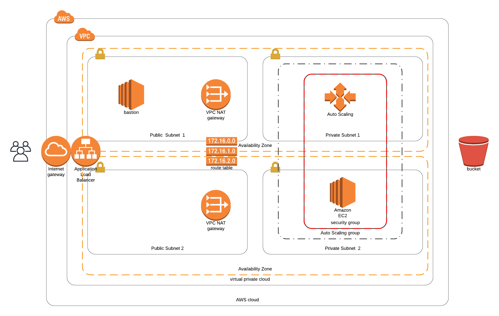

# Projects for the DevOps nanodegree

## Project2. Deploy a high-availability web app using CloudFormation

This cloudFormation stack will deploy the following resources:

- VPC
- Two Public Subnets
- Two Private Subnets
- One Application load balancer
- One bastion host in a public subnet
- Four instances, two on each private subnet
- Routing tables to allow traffic
- One AutoScalingGroup configuration
- One Internet Gateway
- Two NATs, one on each public subnet

Architecture diagram

